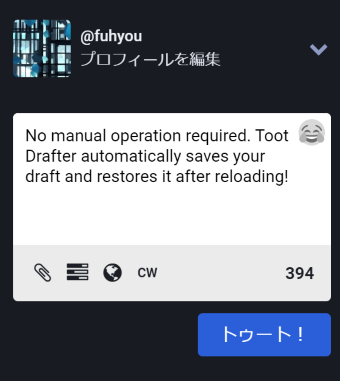

#  Toot Drafter 
## Introduction

As [the feature request](https://github.com/mastodon/mastodon/issues/1133) said, by Jan 29, 2023, the official Web interface for Mastodon has still not introduced drafting functionality yet. It also means your toot will be lost if the browser crashes. That's why Toot Drafter, a Chrome extension, appears as a complement.

No manual operation required. Toot Drafter automatically saves your draft and restores it after reloading.

## How it works

It searches for the toot-inputing `textarea` as well as toot `button` by injecting `script` after each page loads, so as to judge if it is a Web interface for Mastodon.

If so, it calls the native `textarea` setter and triggers `input` event to sync the `textarea` with `localStorage`. Then writes `localStorage` once the user inputs. Removes the draft if toot `button` is clicked.
